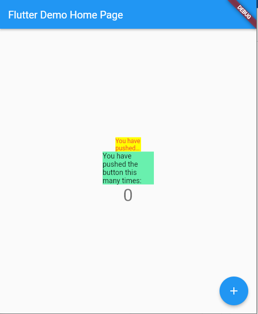
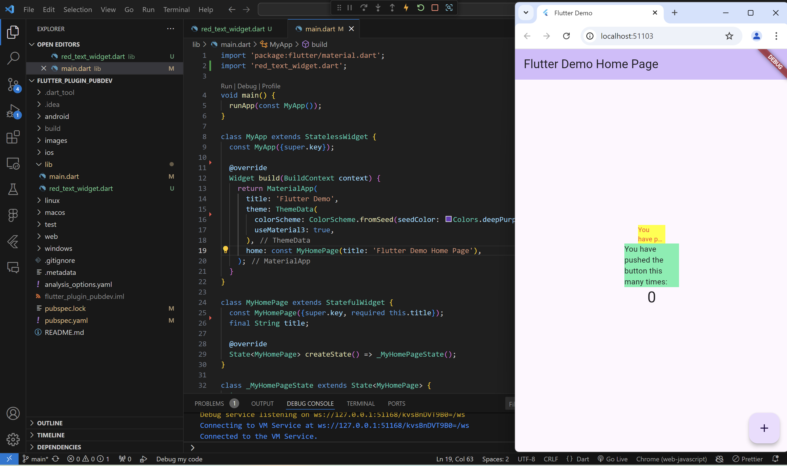

# flutter_plugin_pubdev

A new Flutter project.

## Getting Started


# jobsheet 7:Management Plugin
# Praktikum Menerapkan Plugin di Project Flutter

**Nama: Ikhwandi**
**Nim: 2241720028**
**Kelas: 3F**


Selesaikan langkah-langkah praktikum berikut ini menggunakan editor Visual Studio Code (VS Code) atau Android Studio atau code editor lain kesukaan Anda.

**Langkah 1: Buat Project Baru**

Buatlah sebuah project flutter baru dengan nama flutter_plugin_pubdev. Lalu jadikan repository di GitHub Anda dengan nama flutter_plugin_pubdev.

**Langkah 2: Menambahkan Plugin**

Tambahkan plugin auto_size_text menggunakan perintah berikut di terminal


```
flutter pub add auto_size_text
```

Jika berhasil, maka akan tampil nama plugin beserta versinya di file pubspec.yaml pada bagian dependencies.

**Langkah 3: Buat file red_text_widget.dart**

Buat file baru bernama red_text_widget.dart di dalam folder lib lalu isi kode seperti berikut.


```
import 'package:flutter/material.dart';

class RedTextWidget extends StatelessWidget {
  const RedTextWidget({Key? key}) : super(key: key);

  @override
  Widget build(BuildContext context) {
    return Container();
  }
}

```

**Langkah 4: Tambah Widget AutoSizeText**

Masih di file red_text_widget.dart, untuk menggunakan plugin auto_size_text, ubahlah kode return Container() menjadi seperti berikut.

```
return AutoSizeText(
      text,
      style: const TextStyle(color: Colors.red, fontSize: 14),
      maxLines: 2,
      overflow: TextOverflow.ellipsis,
);
```
Setelah Anda menambahkan kode di atas, Anda akan mendapatkan info error. Mengapa demikian? Jelaskan dalam laporan praktikum Anda!


**Langkah 5: Buat Variabel text dan parameter di constructor**


Tambahkan variabel text dan parameter di constructor seperti berikut.

```
final String text;

const RedTextWidget({Key? key, required this.text}) : super(key: key);
```

**Langkah 6: Tambahkan widget di main.dart**

Buka file main.dart lalu tambahkan di dalam children: pada class _MyHomePageState

```
Container(
   color: Colors.yellowAccent,
   width: 50,
   child: const RedTextWidget(
             text: 'You have pushed the button this many times:',
          ),
),
Container(
    color: Colors.greenAccent,
    width: 100,
    child: const Text(
           'You have pushed the button this many times:',
          ),
),

```

Run aplikasi tersebut dengan tekan F5, maka hasilnya akan seperti berikut.




hasil percobaan:




# 8. Tugas Praktikum

1. Selesaikan Praktikum tersebut, lalu dokumentasikan dan push ke repository Anda berupa screenshot hasil pekerjaan beserta penjelasannya di file README.md!

**2. Jelaskan maksud dari langkah 2 pada praktikum tersebut!**

jawab: 

Tujuan Langkah Ini:
1. Menginstal Plugin

* auto_size_text adalah plugin untuk Flutter yang memungkinkan teks otomatis menyesuaikan ukurannya agar sesuai dengan ruang yang tersedia.
* Ini sangat berguna jika Anda ingin menghindari teks terpotong atau tumpang-tindih saat ditampilkan dalam tampilan responsif.

2. Cara Kerja Perintah flutter pub add

* flutter pub add secara otomatis menambahkan dependensi ke file pubspec.yaml dan mendownload versi terbaru dari plugin.
* Ini menggantikan proses manual menambahkan kode ke dalam file pubspec.yaml.

3. Mengurangi Kesalahan Manual

* Dengan perintah ini, Flutter mengunduh paket dari repository pub.dev dan memastikan semua konfigurasi dilakukan dengan benar, sehingga Anda tidak perlu mengedit file secara manual.

**Contoh Pubspec.yaml Setelah Penambahan:**
Setelah perintah dijalankan, dependensi baru akan terlihat seperti berikut di pubspec.yaml:

```
dependencies:
  flutter:
    sdk: flutter
  auto_size_text: ^3.0.0  # (versi terbaru yang di-download)

```

**3. Jelaskan maksud dari langkah 5 pada praktikum tersebut!**

jawab:

**Maksud dan Tujuan Langkah Ini:**

1. Menyimpan Data dalam Widget

* Variabel text bertipe String dideklarasikan sebagai final agar nilainya tidak bisa diubah setelah diinisialisasi.
* Variabel ini digunakan untuk menyimpan teks yang akan ditampilkan oleh widget RedTextWidget.

2. Menambah Parameter ke Constructor

* Constructor adalah metode khusus untuk membuat instance dari suatu widget.
* Pada constructor di atas, parameter required this.text memastikan bahwa nilai text wajib diberikan saat widget diinisialisasi.

3. Menghubungkan Data dengan Widget

* Dengan mendefinisikan parameter text, widget RedTextWidget dapat menerima input teks secara dinamis.
* Ini membuat widget lebih fleksibel karena teks yang ditampilkan bisa berbeda setiap kali widget dipanggil.

4. Memanggil Constructor dari Superclass

* Baris : super(key: key) digunakan untuk memanggil constructor dari kelas induk (StatelessWidget). Ini memastikan bahwa kunci widget (Key) ditangani dengan benar oleh Flutter untuk optimasi dan identifikasi widget saat rendering.

**4. Pada langkah 6 terdapat dua widget yang ditambahkan, jelaskan fungsi dan perbedaannya!**

jawab:

1. Container dengan RedTextWidget 
```
Container(
  color: Colors.yellowAccent,
  width: 50,
  child: const RedTextWidget(
    text: 'You have pushed the button this many times:',
  ),
),
```

Fungsi:

* Container: Berfungsi sebagai wadah atau pembungkus yang memungkinkan Anda menerapkan properti seperti warna (color), ukuran (width), padding, margin, dan dekorasi.
* RedTextWidget: Ini adalah widget kustom yang dibuat di langkah sebelumnya. Teks di dalamnya ditampilkan dengan warna merah dan menggunakan plugin AutoSizeText untuk menyesuaikan ukuran teks jika ruang terbatas.

kegunaan widget ini:

* Teks dalam RedTextWidget akan otomatis menyesuaikan ukurannya agar muat dalam lebar yang ditentukan (width: 50).
* RedTextWidget memberikan kontrol lebih pada tampilan teks, seperti jumlah maksimum baris dan penanganan overflow.

2. Container dengan Text

```
Container(
  color: Colors.greenAccent,
  width: 100,
  child: const Text(
    'You have pushed the button this many times:',
  ),
),
```

fungsi:
* Container: Sama seperti pada widget pertama, berfungsi untuk membungkus teks dan menerapkan properti seperti warna latar belakang (greenAccent) dan lebar (width: 100).
* Text: Ini adalah widget bawaan Flutter untuk menampilkan teks statis dengan gaya sederhana tanpa penyesuaian otomatis pada ukuran atau overflow.

kegunaan widget ini:
* Teks di dalam widget Text akan tampil seadanya sesuai ukuran default, tanpa penyesuaian otomatis jika ruangnya terbatas. Jika teks lebih panjang dari ruang yang disediakan, teks akan melampaui batas dan tidak otomatis diperkecil.


**Perbedaan Antara Kedua Widget:**


| **Aspek**           | **Container dengan RedTextWidget**                   | **Container dengan Text**                     |
|---------------------|------------------------------------------------------|-----------------------------------------------|
| **Warna Latar**     | yellowAccent                                         | greenAccent                                   |
| **Widget Teks**     | Menggunakan widget kustom RedTextWidget              | Menggunakan widget bawaan Text               |
| **Penyesuaian Teks**| Otomatis menyesuaikan ukuran teks dengan AutoSizeText | Tidak menyesuaikan ukuran teks secara otomatis |
| **Overflow**        | Mengelola overflow dengan ellipsis (...)             | Overflow tidak dikelola, teks bisa melampaui batas |
| **Lebar Kontainer** | 50                                                   | 100                                           |


Kesimpulan:

1. Container dengan RedTextWidget lebih fleksibel karena teks dapat otomatis menyesuaikan ukurannya dengan lebar container dan overflow dikelola dengan baik.
2. Container dengan Text lebih sederhana dan cocok untuk teks pendek, tetapi tidak memiliki kemampuan untuk menyesuaikan ukuran otomatis jika ruang terbatas.


 **5. Jelaskan maksud dari tiap parameter yang ada di dalam plugin auto_size_text berdasarkan tautan pada dokumentasi ini !**

1. key: Mengontrol bagaimana satu widget menggantikan widget lain di dalam widget tree, penting untuk mengidentifikasi widget saat rebuild terjadi.
2. textKey: Digunakan untuk mengatur kunci khusus untuk widget teks hasil.
3. style: Menentukan gaya teks (misalnya warna, ukuran, dan font). Jika tidak diatur, akan menggunakan gaya default.
4. minFontSize: Ukuran teks minimum yang diperbolehkan saat teks menyesuaikan ukuran otomatis.
5. maxFontSize: Ukuran maksimum teks yang diperbolehkan untuk menghindari terlalu besar.
6. stepGranularity: Menentukan langkah penyesuaian ukuran font, yaitu seberapa besar atau kecil ukuran berubah per penyesuaian.
7. presetFontSizes: Daftar ukuran font yang telah ditentukan sebelumnya. Jika digunakan, penyesuaian ukuran akan terbatas pada daftar ini.
8. group: Sinkronisasi ukuran font untuk beberapa instance AutoSizeText agar ukuran font seragam.
9. textAlign: Menentukan perataan horizontal teks (misalnya rata kiri, tengah, atau kanan).
10. textDirection: Menentukan arah teks (misalnya LTR atau RTL) agar sesuai dengan bahasa atau konteks tertentu.
11. locale: Digunakan untuk memilih font yang tepat jika karakter Unicode memiliki variasi tampilan berdasarkan lokal tertentu.
12. softWrap: Mengontrol apakah teks akan dipisah pada soft break.
13. wrapWords: Menentukan apakah kata-kata yang tidak muat pada satu baris akan dibungkus ke baris berikutnya (default: true).
14. overflow: Menentukan bagaimana menangani teks yang melebihi batas tampilan (misalnya, dipotong atau diubah menjadi ellipsis).
15. overflowReplacement: Widget alternatif yang ditampilkan jika teks tidak muat dan melampaui batas.
16. textScaleFactor: Skala font untuk menyesuaikan ukuran teks dengan layar atau perangkat.
17. maxLines: Membatasi jumlah baris maksimal yang bisa digunakan teks.
18. semanticsLabel: Label alternatif untuk teks, penting untuk aksesibilitas.


**6. Kumpulkan laporan praktikum Anda berupa link repository GitHub kepada dosen!**
